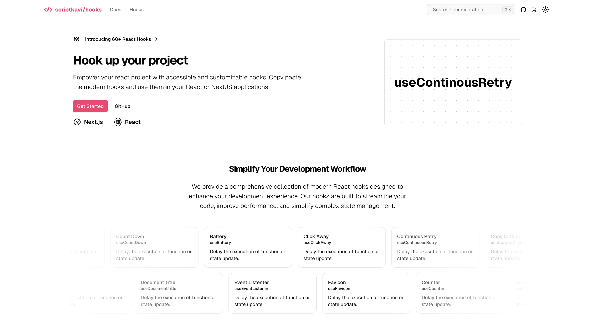

# scriptkavi/hooks

**Hook up your project**

Empower your react project with accessible and customizable hooks. Copy paste the modern hooks and use them in your React or NextJS applications

## Documentation

Visit http://hooks.scriptkavi.com/docs to view the documentation.

## Contributing

Please read the [contributing guide](/CONTRIBUTING.md).

## License

Licensed under the [MIT license](https://github.com/scriptkavi/hooks/blob/main/LICENSE.md).

## Credits

- [shadcn](https://shadcn.com) - For the core inspiration and idea. Without his project, this was not possible.
- [Netlify](https://netlify.com) - Where I host all my projects.
- [useHooks](https://usehooks.com), [ahooks](https://ahooks.pages.dev) - For the hooks.
